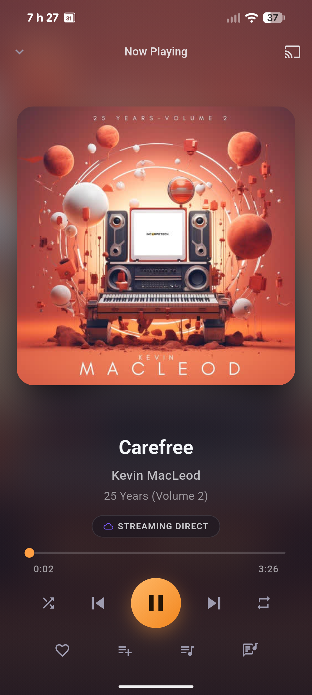
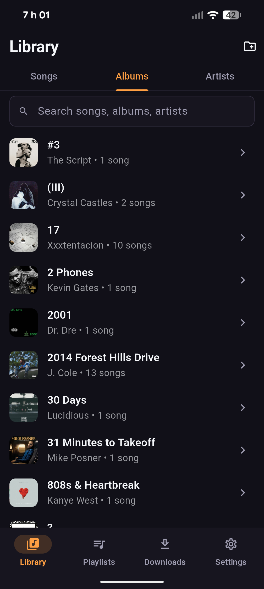
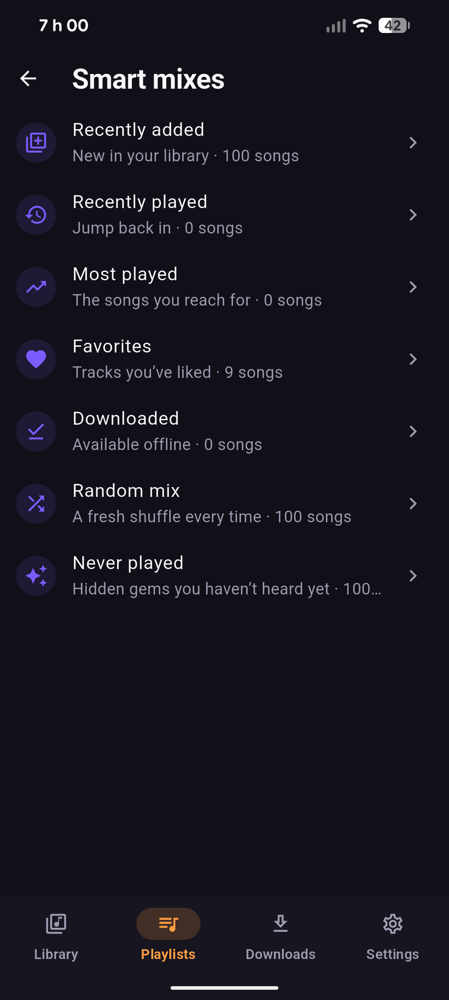

# Linthra

<iframe src="https://github.com/sponsors/TheZupZup/card" title="Sponsor TheZupZup" height="225" width="600" style="border: 0;"></iframe>

### Your music, your server.

**Linthra is an open-source Android music player for people who keep their music
on their own devices or self-hosted servers.** It plays local files and streams
from your own Jellyfin, Navidrome / Subsonic, or Plex server. No ads, no
tracking, no account.

## Features

- Plays music from a folder on your phone. Uses the Android folder picker, so
  it never asks for a broad storage permission.
- Streams from your own Jellyfin, Navidrome / Subsonic, or Plex server.
  Streaming is the default and nothing is downloaded automatically.
- Offline cache: download the tracks you want, Wi-Fi only by default, with a
  size limit and "Keep offline" pinning.
- Chromecast, implemented in pure Dart. No Google Play Services needed.
- Android Auto.
- Queue, playlists and favorites. Playlists and hearts sync both ways with
  Jellyfin and Navidrome, and also work without a server.
- Smart mixes (recently played, most played, never played). Built from
  listening data that stays on the device.
- Background playback with lock-screen, Bluetooth and headset controls,
  shuffle, repeat, and synced lyrics.
- Themes and launcher icon switching.

Each of these has its own page in [the docs](./docs/README.md).

## Screenshots

| Now Playing | Library | Smart mixes |
| --- | --- | --- |
|  |  |  |

More in [`phoneScreenshots/`](fastlane/metadata/android/en-US/images/phoneScreenshots/).

## Install

New versions land on
[GitHub Releases](https://github.com/thezupzup/linthra/releases) first, as
signed APKs. The current stable is v0.1.8. Linthra is also on
[F-Droid](https://f-droid.org/packages/io.github.thezupzup.linthra/); F-Droid
builds may arrive a bit later while their build and review process runs. Not on
Google Play yet.

> **Don't mix install sources.** GitHub APKs and F-Droid builds are signed with
> different keys and can't update each other. Pick one and stick with it.

To install from GitHub Releases and get updates, use
[Obtainium](https://github.com/ImranR98/Obtainium):

1. Install Obtainium.
2. Tap **Add App** and paste the source URL:
   `https://github.com/thezupzup/linthra`
3. Install the latest release. Obtainium handles updates from then on. (Enable
   **"Include prereleases"** only if you want to test pre-release builds.)

Or download the `.apk` from the
[latest release](https://github.com/thezupzup/linthra/releases/latest) and open
it on your phone.

Notes:

- Android Auto only shows sideloaded media apps after a one-time developer
  toggle. See [docs/android-auto.md](./docs/android-auto.md).
- To build from source, see
  [docs/development.md](./docs/development.md).

## Supported sources

| Source | Status |
| --- | --- |
| **Local files** | ✅ Scan a folder, play directly (SAF, no broad permission) ([docs](./docs/local-music.md)) |
| **Jellyfin** | ✅ Stream, cache, cast, playlists & favorites ([docs](./docs/jellyfin.md)) |
| **Navidrome / Subsonic** | ✅ Stream, cache, cast, lyrics, playlists & favorites, two-way sync ([docs](./docs/providers.md)) |
| **Plex** | ✅ Browse, stream & cache from your own Plex Media Server ([docs](./docs/plex.md)) |
| **WebDAV / NAS** | 🔜 Planned, behind the same `MusicSource` interface |

## Privacy

Linthra does not send telemetry or analytics.

- Bug reports are built locally and only sent if you open the prefilled issue
  yourself.
- Downloads only happen when you start them.
- Minimal permissions: playback and internet, no storage permission.
- The server password is used once to get a token, then discarded. The token
  is stored encrypted and never logged.

Details are in [PRIVACY.md](./PRIVACY.md) and the provider docs.

## Contributing

Testing against your own server, screenshots, and doc fixes are useful
contributions, not just code. [CONTRIBUTING.md](./CONTRIBUTING.md) covers
setup. The [contributor roadmap](./docs/contributor-roadmap.md) lists where
help is needed. To support development, see
[docs/SUPPORT.md](./docs/SUPPORT.md).

## Roadmap

See [docs/roadmap.md](./docs/roadmap.md). In short: stabilize 0.1.x, then
backup/restore, then the optional Linthra Connect and a desktop app. Linthra
always works on its own: no Docker, no account, no required pairing.

## Documentation

Everything is indexed in [docs/README.md](./docs/README.md): setup,
architecture, and a page per feature.

## License

[MPL-2.0](./LICENSE)
